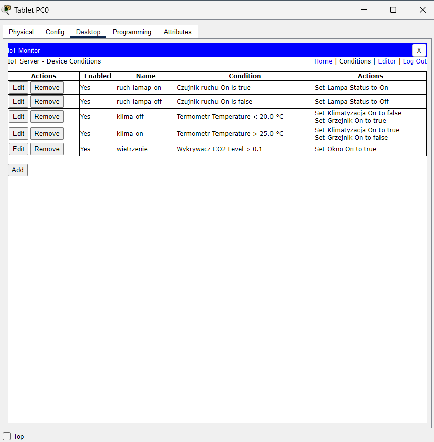

# Przykłady życia codziennego

- automatyczne włączanie światła przy wykryciu ruchu,

- uruchamianie klimatyzacji, gdy temperatura przekracza ustalony poziom,

- podnoszenie rolet po wschodzie słońca,

- ...

---

# Logika warunkowa - operatory

IF-THEN - jeśli warunek jest spełniony, wykonaj akcję

Operator AND - wszystkie warunki muszą być spełnione

Operator OR - jeden z warunków musi być spełniony

Przetwarzanie leniwe.

---

### Logika warunkowa - grupowanie warunków

Uruchom klimatyzację jeśli jest lato i temperatura w domu przekracza 25 stopni lub do zachodu słońca została więcej niż jedna godzina.

--

IF pora_roku == "lato" AND temperatura > 25 OR zachod_slonca > 1 THEN klimatyzacja

--

IF pora_roku == "lato" AND (temperatura > 25 OR zachod_slonca > 1) THEN klimatyzacja

---

# Packet tracer

IoT Monitor -> Conditions

.pull-left[



]

.pull-right[


]

---

# Ćwiczenia

1. Stworzenie nowego projektu, dodanie urządzeń IoT i podłączenie do sieci.

2. Jeśli temperatura przekroczy 25 stopni to uruchom klimatyzację.

3. Jeśli czujnik ruchu wykryje ruch, to włącz lampę.

4. Jeśli poziom dwutlenku węgla wzrośnie, to otwórz okno.

---

class: inverse

# Zadania

```{r include=FALSE}
library(tidyverse)
library(countdown)
```

`r countdown(minutes = 15, seconds = 0, top = 0)`

1. Utwórz regułę, która włączy ogrzewanie, gdy temperatura spadnie poniżej 18 stopni, i klimatyzację, gdy przekroczy 25 stopni.

2. Utwórz regułę, w której światło włącza się tylko wtedy, gdy jest wykryty ruch i gdy czas jest po zachodzie słońca.

3. Utwórz regułę, w której okna są zamykane gdy pada deszcz.

---

class: center, middle, inverse

# Pytania?