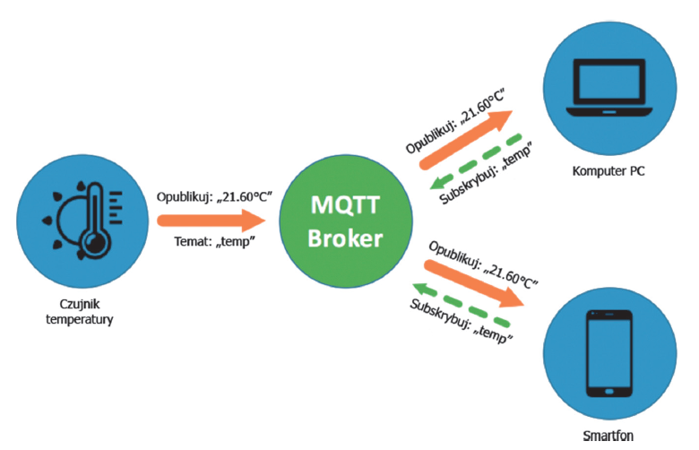

# Wprowadzenie do MQTT

- **MQTT (Message Queuing Telemetry Transport)**: Lekki protokół komunikacyjny oparty na modelu publikacja-subskrypcja.  

- **Opracowany przez:** IBM w 1999 roku, zoptymalizowany pod kątem urządzeń o niskich zasobach i sieci o ograniczonej przepustowości.  

- **Dlaczego MQTT?**
  - Minimalne narzuty danych.
  - Wysoka niezawodność nawet w niestabilnych sieciach.
  - Prosta implementacja.  

---

# Zalety i ograniczenia MQTT

**Zalety:**  
- Niskie zużycie energii i danych.  
- Wszechstronność w zastosowaniach IoT.  
- Prosta implementacja w różnych językach programowania.  

**Ograniczenia:**  
- Brak wbudowanej semantyki biznesowej.  
- Potrzebne dodatkowe zabezpieczenia przy przesyłaniu wrażliwych danych.

---

# Architektura MQTT

- **Model Publikacja-Subskrypcja:**  
  - **Broker**: Centralny element zarządzający przesyłaniem wiadomości.  
  - **Klient**: Urządzenie IoT lub aplikacja wysyłająca (publikująca) i/lub odbierająca wiadomości.  
  
- **Główne komponenty:**
  - **Tematy (topics):** Kanały komunikacyjne zorganizowane hierarchicznie (np. `sensors/temperature`).  
  - **Wiadomości:** Drobne porcje danych przesyłane między klientami.  

---

# Kluczowe cechy MQTT

1. **QoS (Quality of Service):**  
   - **QoS 0:** Dostarcz, jeśli możliwe.  
   - **QoS 1:** Dostarcz co najmniej raz.  
   - **QoS 2:** Dostarcz dokładnie raz.  
2. **Trwałość połączeń:**  
   - Wsparcie dla trybu *"Last Will and Testament"* (ostatnia wola klienta).  
3. **Lekkość:** Minimalne zapotrzebowanie na zasoby.  
4. **Bezpieczeństwo:** TLS/SSL, uwierzytelnianie użytkowników.  
5. **Retencja danych:** Możliwość przechowywania ostatnich wiadomości przez brokera.  

---

# Quality of Service

| **Poziom QoS** | **Opis**              | **Gwarancja dostarczenia** | **Ryzyko duplikatów** | **Zastosowanie**                       |
|----------------|-----------------------|----------------------------|-----------------------|----------------------------------------|
| **QoS 0**      | Co najwyżej raz       | Brak                      | Nie                  | Szybkie dane telemetryczne.            |
| **QoS 1**      | Co najmniej raz       | Tak                       | Tak                  | Polecenia sterujące, monitorowanie.    |
| **QoS 2**      | Dokładnie raz         | Tak                       | Nie                  | Transakcje finansowe, krytyczne dane.  |

---

# Przepływ komunikacji MQTT

1. **Klient publikuje wiadomość** na określony temat (topic).  
2. **Broker MQTT** odbiera wiadomość i przesyła ją wszystkim subskrybentom danego tematu.  
3. **Subskrybenci** otrzymują wiadomość zgodnie z poziomem QoS.  

---

# Przepływ komunikacji MQTT



---

# Przykłady wdrożeń

1. **HiveMQ:**  
   - Broker MQTT stosowany w systemach IoT dla przemysłu i motoryzacji.  
2. **AWS IoT Core:**  
   - Rozwiązania chmurowe wspierające MQTT dla aplikacji IoT.  
3. **Eclipse Mosquitto:**  
   - Open-source’owy broker MQTT dla małych i dużych aplikacji.  

---

# Narzędzia do MQTT

- **Brokery:**
  - Eclipse Mosquitto (lokalny, open-source).  
  - HiveMQ (komercyjny i open-source).  
- **Klienci testowi:**
  - [MQTT Explorer](https://mqtt-explorer.com/) (graficzny klient).  
  - CLI Mosquitto (narzędzie wiersza poleceń).  
- **Biblioteki programistyczne:**
  - Python: `paho-mqtt`.  

---

# Otwarte serwery MQTT

- test.mosquitto.org

- mqtt.eclipseprojects.io

- broker.emqx.io

---

# Ćwiczenie

Pokazanie działania publikacji i subskrypcji w MQTT.  

https://github.com/DamascenoRafael/mqtt-simulator

---

# Subskrypcja

```python
import paho.mqtt.client as mqtt

# Funkcja obsługująca odbieranie wiadomości
def on_message(client, userdata, msg):
  print(f"Received `{msg.payload.decode()}` from `{msg.topic}` topic")

client = mqtt.Client() # Tworzenie klienta MQTT
client.connect("localhost", 1883) # Łączenie z brokerem MQTT
client.subscribe("sensors/temperature") # Subskrybujemy temat 

# Przypisujemy funkcję obsługującą odbieranie wiadomości
client.on_message = on_message

# Startujemy pętlę obsługi MQTT
client.loop_forever()
```

---

# Publikacja

```python
import paho.mqtt.client as mqtt

# Funkcja wywoływana po pomyślnym połączeniu z brokerem
def on_connect(client, userdata, flags, rc):
    if rc == 0:
        print("Successfully connected to the broker!")
    else:
        print(f"Failed to connect, return code {rc}")

client = mqtt.Client() # Tworzymy nowego klienta MQTT

# Rejestrujemy funkcję obsługi zdarzenia połączenia
client.on_connect = on_connect
client.connect("localhost", 1883) # Łączymy się z brokerem MQTT

# Publikowanie wiadomości
topic = "sensors/temperature"
message = "25.5°C"

# Publikujemy wiadomość na wybrany temat
client.publish(topic, message)
print(f"Published `{message}` to `{topic}` topic")

client.disconnect() # Zamykamy połączenie
```

---

class: inverse

```{r include=FALSE}
library(countdown)
```

`r countdown(minutes = 15, seconds = 0, top = 0)`

# Zadanie

Napisz program, który do tematu `tir_us/imie_pierwsza_litera_nazwiska/ram` będzie co 30 sekund publikować aktualne zużycie pamięci RAM komputera wyrażone w procentach. 

---

class: center, middle, inverse

# Pytania?