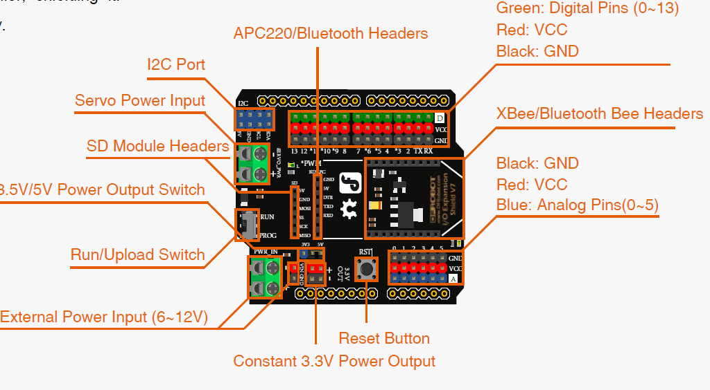

# Gravity Starter Kit

- DFRduino UNO R3
- IO Expansion Shield for Arduino V7.1 
- Digital Piranha LED Module-Red 
- Digital Piranha LED Module-Green 
- Digital piranha LED module-Yellow 
- Digital Push Button (Yellow)
- Analog Ambient Light Sensor
- Analog Sound Sensor
- Analog Rotation Sensor V1
- Digital Buzzer Module
- PIR (Motion) Sensor
- Digital Tilt Sensor for Arduino V2
- Adjustable Infrared Distance Sensor
- 9g Metal Gear Micro Servo (1.8Kg)
- 6xAA Battery Holder with DC2.1 Power Jack
- USB Cable A-B for Arduino 

---

# DFRduino Uno


---

# I/O Expansion Shield V7.1




---

# Sygnał cyfrowy i analogowy


---

# Przycisk

```c
int pushButton = 2; 

void setup(){
  Serial.begin(9600); 
  pinMode(pushButton, INPUT); 
}

void loop() { 
  int buttonState = digitalRead(pushButton); 
  Serial.println(buttonState); 
  delay(1); 
}
```

---

# Potencjometr

```c
void setup() { 
  Serial.begin(9600); 
}

void loop() { 
  int sensorValue = analogRead(A0);
  Serial.println(sensorValue);
  delay(1);
}
```

---

# LED

```c
int ledPin = 13;

void setup() {
  pinMode(ledPin, OUTPUT);
}

void loop() {
  digitalWrite(ledPin, HIGH);
  delay(1000);
  digitalWrite(ledPin, LOW);
  delay(1000);
}
```

---

class: inverse

# Zadania

```{r include=FALSE}
library(countdown)
```

`r countdown(minutes = 15, seconds = 0, top = 0)`

1. Z wykorzystaniem diody LED i czujnika ruchu, stwórz lampkę reagującą na ruch.

2. Reguluj natężenie światła z wykorzystaniem potencjometru

```
int outputValue = map(sensorValue, 0, 1023, 0, 255);
```

3. Włącznik cyfrowy do diody LED

---

# Servo

```c
#include <Servo.h>

int sensorPin = 3; // tilt sensor D3
Servo myservo;
int pos = 0;

void setup() {
  Serial.begin(9600);
  pinMode(sensorPin, INPUT);
  myservo.attach(9); // Servo – D9
}
```

---

# Servo

```c
void loop() {
  int sensorState = digitalRead(sensorPin);
  Serial.println(sensorState);
  if (!sensorState) { //If the state is 0, The servo moves 2° 
    pos = pos + 2;
    if (pos >= 180) {
      pos = 180;
    }
    myservo.write(pos); //Write in rotation angle of the Servo
    Serial.println(pos); // Print rotation angle in serial port
    delay(100);
  } else { // Else, the servo moves 2° less but not less than 0°.
    pos = pos - 2;
    if (pos <= 0) {
    pos = 0;
    }
  myservo.write(pos);
  Serial.println(pos);
  delay(100);
  }
  delay(1);
}
```

---

# Buzzer

Funkcja `tone` przyjmuje trzy argumenty:

- pin - numer pinu cyfrowego

- frequency - częstotliwość tonu w Hz

- duration - czas trwania tonu w milisekundach

```c
int buzzer = 6; 

void setup() {
pinMode(buzzer, OUTPUT);
}
void loop() {
tone(buzzerPin, 300, 150); 
delay(1000);
}
```

---

# Przykładowe projekty

1. System alarmowy - czujnik ruchu, buzzer, dioda LED

2. Zamek elektroniczny - przycisk, diody LED, buzzer

3. Automatyczne rolety - servo, czujnik światła

---

class: center, middle, inverse

# Pytania?