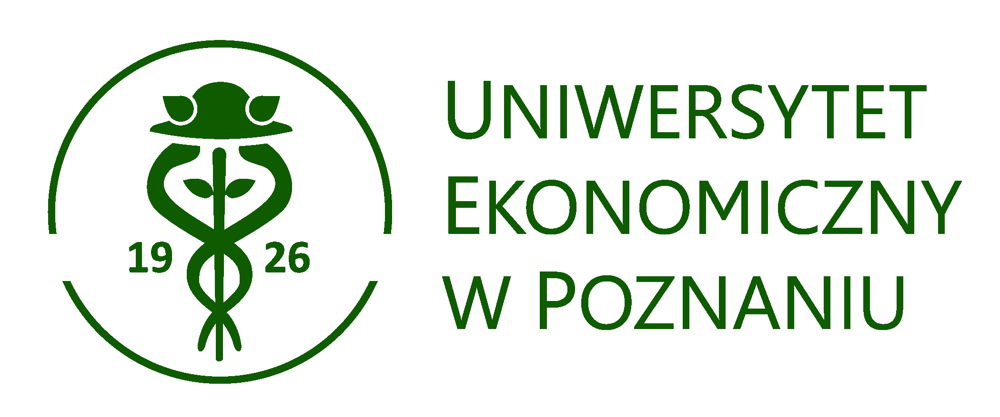
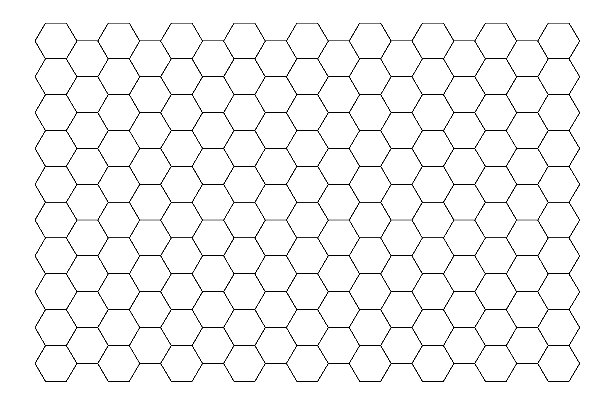

# Łukasz Wawrowski

.pull-left[


__Nauczyciel akademicki__

Dydaktyka:
- Statystyka opisowa
- Statystyka matematyczna
- Metoda reprezentacyjna
- Przetwarzanie danych

Naukowo:
- Estymacja ubóstwa

]

.pull-right[


__Analityk Big Data__

- Projektowanie gry
- Implemementacja algorytmów
- Analityka
- Sztuczna inteligencja

]

.footnote[Grafika tytułowa: [Ethix360](http://www.ethix360.com/blog/2018/8/29/ai-ethics-from-man-vs-machine-to-morality-vs-machine)]

???

Image credit: [Ethix360](http://www.ethix360.com/blog/2018/8/29/ai-ethics-from-man-vs-machine-to-morality-vs-machine)


---

# Projekt GAMEINN

<center>Opracowanie silnika sztucznej inteligencji w strategicznej grze ekonomicznej w celu urealnienia i udoskonalenia interakcji graczy z NPC</center>

--

- projekt finansowany przez NCBiR
- czas trwania: 3 lata
- dwa moduły gry
- dwie części projektu

---

# Pasja wygrywa ze zdrowym rozsądkiem

--


--


--


--


---

# Gra turowa

- kółko i krzyżyk
- szachy
- Heroes 3

---

# Koncepcja gry

- walka pomiędzy dwoma drużynami
- jednostki są zróżnicowane pod względem:
   - mobilności
   - zasięgu strzału
   - siły ataku
   - obrony
   - celności
   - ...
- na planszy występują różne przeszkody

---

# Plansza - kwadraty i sześciokąty

--

.pull-left[


Dwie odległości.
]

.pull-right[


Jedna odległość.
]

--

[H3: Uber’s Hexagonal Hierarchical Spatial Index](https://eng.uber.com/h3/)

---

# Plansza w R

--

```{r tidy=FALSE, eval=FALSE}
library(sp)
coord <- matrix(c(0,0, 0, 15, 10, 15, 10,0, 0, 0), ncol=2, byrow=T)

pg <- Polygon(coord)
ps <- Polygons(list(pg),1)
sps <- SpatialPolygons(list(ps), 
                       proj4string = CRS(as.character(NA)))

hexpoints <- spsample(sps, n=100, type="hexagonal", cellsize=1)
hexgrid <- HexPoints2SpatialPolygons(hexpoints, dx = 1)
```

---

# Plansza w R



---

# Interaktywność

```{r tidy=FALSE, eval=FALSE}
library(shiny)

plotOutput(outputId, width = "100%", height = "400px", 
           click = NULL,
           dblclick = NULL, 
           hover = NULL, ...)

```

---

# Poruszanie się po planszy

```{r tidy=FALSE, eval=FALSE}
library(rgeos)

gContains() # czy punkt jest jednostką
gDistance() # odległość 
gIntersects() # co znajduje się po drodze

```

---

# Gra


---

background-image: url(img/jazz.png)

---

# Definicja wygranej

Maksymalizacja obrażeń przeciwnika przy jednoczesnym ograniczeniu strat własnych.

- 4:0
- 1:0

---

# Easy

Prosty algorytm.


---

# Medium

Funkcja oceniająca możliwe akcje dla stanu gry.

- strzał spowoduje wyeliminowanie jednostki: +100
- na linii strzału znajduje się przeszkoda: -20
- ruch spowoduje narażenie się na strzał: -50
- ...

--

Wybór akcji, która charakteryzuje się najwyższą wartością funkcji.

---

# Hard

Rozegranie wielu rozgrywek i wykorzystanie zebranych danych do stworzenia funkcji oceniającej możliwe akcje.

[shinyapps.io](https://www.shinyapps.io/) + googlesheets

--

Definicja udanej akcji.

Wiele klasyfikatorów do wyboru.

---

# Turbo

__Alogrytmm minimax__

Przewidywanie akcji przeciwnika do końca gry.

Bardzo duża złożoność obliczeniowa.

W szachach około $20^{50}$ stanów gry.

--

__Uczenie się ze wzmocnieniem__

Agent nie zna środowiska.

Maksymalizacja określonego kryterium.

---

class: inverse

# Dziękuję za uwagę!


.footnote[https://www.cartoonmovement.com/cartoon/28422]

???

[](https://www.cartoonmovement.com/cartoon/28422)

